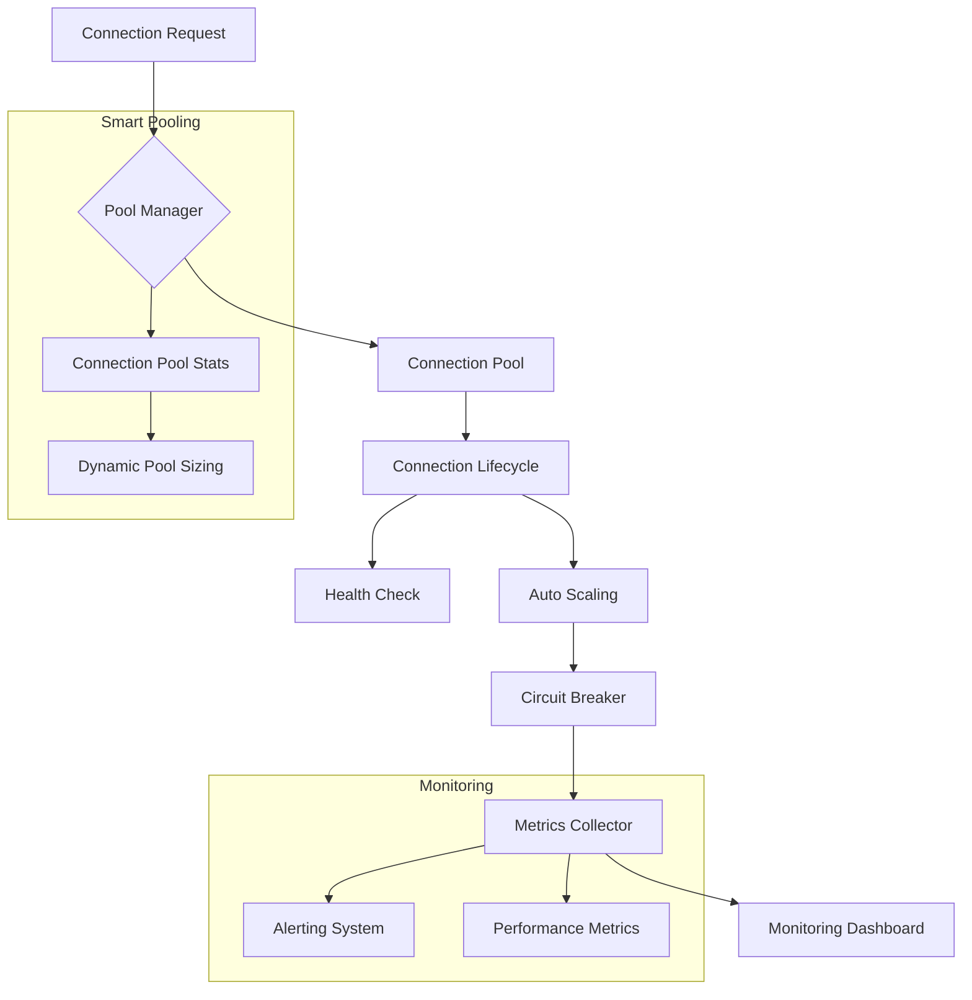

# HWA-New Performance Optimization Plan

## 1. Technical Specification for Smart Pooling

### smart_pooling.py Architecture



### Key Components

1. **Connection Pool Stats**
   - Track active/idle connections
   - Monitor wait times and errors
   - Implement dynamic TTL for connections

2. **Auto Scaling**
   ```python
   def calculate_optimal_size(current_load: float, historical_data: list) -> int:
       # Implementation using exponential backoff and load analysis
       base_size = max(self.config.min_size, int(current_load * 0.7))
       growth_factor = 1 + (current_load - base_size) / self.config.max_size
       return min(base_size * growth_factor, self.config.max_size)
   ```

3. **Health Check**
   - Proactive connection validation
   - Automatic dead connection removal
   - Circuit breaker pattern for failing nodes

4. **Metrics Collector**
   - Track latency percentiles (p50, p90, p99)
   - Monitor connection pool utilization
   - Record error rates and retry patterns

## 2. Implementation Plan

### Phase 1: Technical Specification (Week 1-2)
- Complete smart_pooling.py implementation
- Add comprehensive type hints and docstrings
- Create unit tests for all components
- Develop integration tests with mocked dependencies

### Phase 2: Core Features (Week 3-5)
1. **Connection Pooling Optimization**
   - Implement dynamic pool sizing
   - Add connection health checks
   - Integrate circuit breaker pattern

2. **Cache Management**
   - Implement multi-level cache with Redis
   - Add dynamic TTL based on access patterns
   - Create cache invalidation strategies

### Phase 3: Monitoring & Testing (Week 6)
1. **Benchmarking**
   - measure current performance baseline
   - Test under load with locust
   - Capture metrics for latency, throughput, error rates

2. **Integration Tests**
   - Test pool behavior under high load
   - Validate health check functionality
   - Verify circuit breaker activation

3. **Monitoring Setup**
   - Configure Prometheus metrics
   - Set up Grafana dashboards
   - Implement alerting thresholds

## 3. Risk Mitigation

1. **Rollback Strategy**
   - Blue/green deployment for pool changes
   - Feature toggles for new pooling logic
   - Automated rollback on performance degradation

2. **Testing Approach**
   - Unit tests for individual components
   - Integration tests for interactions
   - Load testing with realistic scenarios
   - Chaos testing for failure scenarios

## 4. Documentation Plan

1. **Architecture Documentation**
   - Updated system architecture diagram
   - Component interaction diagrams
   - Decision log for design choices

2. **Operations Guide**
   - Monitoring procedures
   - Alert response checklist
   - Scaling guidelines

3. **Developer Guide**
   - Code overview
   - Testing strategies
   - Optimization patterns